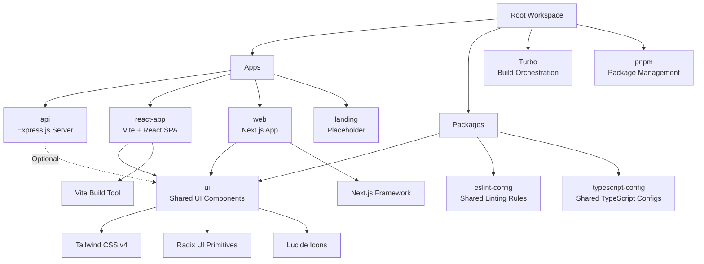

# Monorepo Architecture Documentation

## Overview

This repository is a monorepo template built with shadcn/ui, utilizing pnpm for package management and Turbo for build orchestration. It provides a scalable structure for developing multiple applications and shared packages, with a focus on React-based frontend applications using Tailwind CSS v4, Next.js, and a shared UI component library.

The monorepo includes:

- **Apps**: Multiple applications (API server, React SPA, Next.js web app, and a placeholder landing page)
- **Packages**: Shared configurations and UI components
- **Tooling**: TypeScript, ESLint, Prettier, and Turbo for efficient development and builds

## Architecture Diagram



## Apps Overview

### React Applications (Focus Areas)

#### react-app (Vite + React SPA)

- **Framework**: React 19 with Vite for fast development and building
- **Styling**: Tailwind CSS v4 for utility-first CSS
- **UI Components**: Consumes the shared `@workspace/ui` package
- **Features**: Demonstrates shadcn/ui components including NavigationMenu, Button, Input, and Toaster
- **Port**: Runs on port 3001 in development
- **Purpose**: Showcase and test UI components in a client-side rendered React application

#### web (Next.js Application)

- **Framework**: Next.js 15 with App Router and Turbopack for development
- **Styling**: Tailwind CSS v4 integrated via the UI package
- **UI Components**: Uses shared components from `@workspace/ui`
- **Features**: Server-side rendering capable, demonstrates the same UI components as react-app but in a Next.js context
- **Themes**: Supports dark/light mode via next-themes
- **Purpose**: Production-ready web application with SSR/SSG capabilities

### Other Apps

#### api (Express.js Server)

- **Framework**: Express.js with TypeScript
- **Features**: RESTful API with health checks and sample user endpoints
- **Security**: Helmet for security headers, CORS support
- **Build**: Uses tsup for bundling
- **Port**: Runs on port 3002 in development

#### landing (Placeholder)

- Currently empty, intended for a marketing or landing page application

## Shared Packages

### UI Package (@workspace/ui) - Primary Focus

The UI package is the core shared component library, designed for React applications:

- **Components**: Button, Input, NavigationMenu, Sonner (toast notifications), and more
- **Styling**: Built with Tailwind CSS v4 and class-variance-authority for variant management
- **Primitives**: Uses Radix UI for accessible, unstyled primitives
- **Icons**: Lucide React for consistent iconography
- **Exports**: Modular exports for components, styles, and utilities
- **Architecture**: Follows shadcn/ui patterns with composable, customizable components

Key features:

- **Accessibility**: Radix UI primitives ensure WCAG compliance
- **Theming**: Supports CSS variables for easy customization
- **Performance**: Tree-shakable imports and optimized bundles
- **Developer Experience**: TypeScript support with proper prop types

### Configuration Packages

#### eslint-config

- Provides shared ESLint configurations for different environments (base, Next.js, React, Vite)
- Ensures consistent code quality across the monorepo

#### typescript-config

- Shared TypeScript configurations for base, Next.js, React library, and Vite setups
- Maintains type safety and compilation consistency

## Build and Development Workflows

### Package Management

- **pnpm**: Fast, disk-efficient package manager with workspace support
- **Workspace Configuration**: `pnpm-workspace.yaml` defines package locations

### Build Orchestration

- **Turbo**: Caches builds and runs tasks in parallel
- **Tasks**: build, dev, lint, check-types with proper dependencies
- **Caching**: Intelligent caching of outputs (.next, dist) and inputs

### Development Scripts

- `pnpm dev`: Runs all apps in development mode
- `pnpm dev:web`, `pnpm dev:api`: Run specific apps
- `pnpm build`: Builds all packages and apps
- `pnpm lint`: Lints the entire codebase

## Extending the Monorepo

### Adding New Apps

1. **Create App Directory**:

   ```bash
   mkdir apps/new-app
   cd apps/new-app
   ```

2. **Initialize Package**:

   ```bash
   pnpm init
   ```

3. **Configure package.json**:

   ```json
   {
     "name": "new-app",
     "private": true,
     "scripts": {
       "dev": "vite",
       "build": "vite build",
       "lint": "eslint ."
     },
     "dependencies": {
       "@workspace/ui": "workspace:*"
     },
     "devDependencies": {
       "@workspace/eslint-config": "workspace:*",
       "@workspace/typescript-config": "workspace:*"
     }
   }
   ```

4. **Add Configuration Files**:
   - `tsconfig.json`: Extend from workspace config
   - `vite.config.ts` or `next.config.mjs`: Build configuration
   - `eslint.config.js`: Use workspace ESLint config

5. **Update Turbo (if needed)**:
   - Turbo automatically detects new packages in the workspace
   - Add custom tasks in `turbo.json` if required

6. **Import Shared Packages**:
   ```tsx
   import { Button } from "@workspace/ui/components/button";
   ```

### Adding Components to UI Package

1. **Create Component File**:

   ```bash
   touch packages/ui/src/components/new-component.tsx
   ```

2. **Implement Component**:
   - Follow existing patterns (Radix UI + Tailwind)
   - Export from `packages/ui/src/components/index.ts`

3. **Update Exports**:
   - Add to `package.json` exports if needed

4. **Test in Apps**:
   - Import and use in react-app or web

## CI/CD Pipelines

### GitHub Actions Setup

Create `.github/workflows/ci.yml`:

```yaml
name: CI

on:
  push:
    branches: [main]
  pull_request:
    branches: [main]

jobs:
  lint:
    runs-on: ubuntu-latest
    steps:
      - uses: actions/checkout@v4
      - uses: pnpm/action-setup@v4
        with:
          version: 10.4.1
      - name: Setup Node.js
        uses: actions/setup-node@v4
        with:
          node-version: "20"
          cache: "pnpm"
      - name: Install dependencies
        run: pnpm install
      - name: Lint
        run: pnpm lint

  build:
    runs-on: ubuntu-latest
    steps:
      - uses: actions/checkout@v4
      - uses: pnpm/action-setup@v4
        with:
          version: 10.4.1
      - name: Setup Node.js
        uses: actions/setup-node@v4
        with:
          node-version: "20"
          cache: "pnpm"
      - name: Install dependencies
        run: pnpm install
      - name: Build
        run: pnpm build

  test:
    runs-on: ubuntu-latest
    steps:
      - uses: actions/checkout@v4
      - uses: pnpm/action-setup@v4
        with:
          version: 10.4.1
      - name: Setup Node.js
        uses: actions/setup-node@v4
        with:
          node-version: "20"
          cache: "pnpm"
      - name: Install dependencies
        run: pnpm install
      - name: Run tests
        run: pnpm test # Add test scripts to packages

  deploy-web:
    needs: [lint, build, test]
    runs-on: ubuntu-latest
    if: github.ref == 'refs/heads/main'
    steps:
      - uses: actions/checkout@v4
      - uses: pnpm/action-setup@v4
        with:
          version: 10.4.1
      - name: Setup Node.js
        uses: actions/setup-node@v4
        with:
          node-version: "20"
          cache: "pnpm"
      - name: Install dependencies
        run: pnpm install
      - name: Build web app
        run: pnpm build --filter=web
      - name: Deploy to Vercel
        uses: amondnet/vercel-action@v25
        with:
          vercel-token: ${{ secrets.VERCEL_TOKEN }}
          vercel-args: "--prod"
          vercel-org-id: ${{ secrets.VERCEL_ORG_ID }}
          vercel-project-id: ${{ secrets.VERCEL_PROJECT_ID }}
          working-directory: apps/web

  deploy-api:
    needs: [lint, build, test]
    runs-on: ubuntu-latest
    if: github.ref == 'refs/heads/main'
    steps:
      - uses: actions/checkout@v4
      - uses: pnpm/action-setup@v4
        with:
          version: 10.4.1
      - name: Setup Node.js
        uses: actions/setup-node@v4
        with:
          node-version: "20"
          cache: "pnpm"
      - name: Install dependencies
        run: pnpm install
      - name: Build API
        run: pnpm build --filter=api
      - name: Deploy to Railway
        uses: railwayapp/railway-action@v1
        with:
          railway-token: ${{ secrets.RAILWAY_TOKEN }}
          service: api
```

### Additional Pipeline Suggestions

- **E2E Testing**: Add Playwright or Cypress for end-to-end tests
- **Performance Monitoring**: Integrate Lighthouse CI for performance budgets
- **Security Scanning**: Add Snyk or CodeQL for vulnerability checks
- **Preview Deployments**: Deploy PR branches to preview URLs
- **Release Automation**: Use Changesets for version management and releases

## Best Practices

### Development

- Use workspace versions (`workspace:*`) for internal dependencies
- Follow the established component patterns in the UI package
- Leverage Turbo's caching for faster builds
- Use the shared ESLint and TypeScript configs

### Architecture Decisions

- Keep apps focused on their specific domains
- Use the UI package for all shared components
- Prefer server components in Next.js when possible
- Maintain clear separation between API and frontend concerns

### Performance

- Utilize Next.js App Router for optimal loading
- Implement proper code splitting with dynamic imports
- Use Tailwind's purging for minimal CSS bundles
- Cache API responses appropriately

This architecture provides a solid foundation for scalable React applications with shared UI components, efficient tooling, and automated deployment pipelines.
