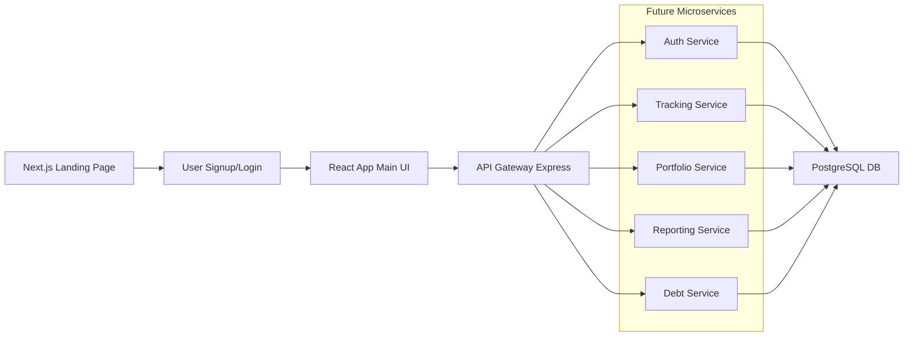

# 💰 Shonchoy

> **Shonchoy** (Bengali: সঞ্চয় meaning "savings") - A modern, scalable personal finance tracking platform built with cutting-edge web technologies.

<div align="center">


**Status:** 🚧 In Development | **Version:** MVP Phase

</div>

---

## 📑 Table of Contents

- [Architecture Overview](#architecture-overview)
- [Technology Stack](#technology-stack)
- [Features](#features)
- [Project Structure](#project-structure)
- [Getting Started](#getting-started)
- [Development Workflow](#development-workflow)
- [API Documentation](#api-documentation)
- [Database Schema](#database-schema)
- [Roadmap](#roadmap)

---

## 🏗 Architecture Overview

Shonchoy is built as a modern monorepo utilizing a client-server architecture with REST APIs, designed for scalability and maintainable code organization.

### High-Level Architecture



### Design Principles

- **Monorepo Structure**: Centralized codebase with pnpm workspaces and Turbo build orchestration
- **API Gateway Pattern**: Centralized request routing with authentication, logging, and rate limiting
- **Microservices Ready**: Architecture designed for future migration to microservices with NestJS
- **Mobile-First**: PWA-enabled responsive design for cross-platform compatibility

---

## 🛠 Technology Stack

### Frontend

- **React 19** with TypeScript and Vite for lightning-fast development
- **Next.js 15** with App Router for the landing page and SEO optimization
- **shadcn/ui** + **Tailwind CSS v4** for modern, accessible UI components
- **Chart.js** for interactive financial visualizations
- **React Query** for efficient server state management

### Backend

- **Express.js** with TypeScript and API gateway pattern
- **PostgreSQL** with TypeORM for robust data persistence
- **JWT Authentication** with OAuth support (Google, Apple)
- **Node-cron** for automated alerts and recurring tasks

### DevOps & Tooling

- **pnpm** for efficient package management
- **Turbo** for intelligent build caching and parallelization
- **ESLint & Prettier** for code quality consistency
- **Jest & Cypress** for comprehensive testing coverage
- **GitHub Actions** for CI/CD pipeline automation

---

## ✨ Features

### Core Functionality

- **📊 Income & Expense Tracking**: Manual entry with customizable categories and CSV import
- **💰 Envelope Budgeting**: Assign budgets per category with visual overspend alerts
- **📈 Portfolio Management**: Investment allocation tools with compound interest projections
- **🏦 Debt Management**: Advanced loan/credit card calculators with payoff simulations
- **📱 Joint Accounts**: Multi-user access with permission levels and merged views

### Advanced Features

- **🔮 What-If Simulations**: Interactive scenario planning for financial decisions
- **📊 Smart Visualizations**: Real-time charts and dashboards with trend analysis
- **⚡ Habit Insights**: Identify spending patterns and savings opportunities
- **🎯 Goal Tracking**: Monitor progress toward financial targets with milestone alerts
- **📄 Export Tools**: Generate reports in PDF/CSV formats

---

## 📁 Project Structure

```
shonchoy/
├── apps/
│   ├── api/                    # Express.js API server
│   ├── react-app/              # Main Vite+React SPA
│   ├── web/                    # Next.js landing page
│   └── landing/                # Future marketing site
├── packages/
│   ├── ui/                     # Shared shadcn/ui components
│   ├── eslint-config/          # Shared linting rules
│   └── typescript-config/      # Shared TS configurations
├── docs/                       # Project documentation
│   ├── pitchdeck.md
│   ├── project_requirement_document.md
│   ├── repository_architecture.md
│   ├── strategic_review.md
│   └── task_breakdown.md
├── scripts/                    # Build and utility scripts
├── .github/                    # GitHub Actions workflows
├── turbo.json                  # Turbo build configuration
├── pnpm-workspace.yaml         # pnpm workspace definition
└── package.json                # Root package configuration
```

### Key Directories

- **`apps/react-app/`**: Primary user interface built with React 19 and Vite
- **`apps/web/`**: Marketing and landing pages using Next.js for SEO optimization
- **`apps/api/`**: RESTful API server with Express.js and PostgreSQL integration
- **`packages/ui/`**: Shared component library based on shadcn/ui and Radix primitives

---

## 🚀 Getting Started

### Prerequisites

- **Node.js** (v20 or higher)
- **pnpm** (v9 or higher)
- **PostgreSQL** (v14 or higher)
- **Docker** (optional, for database)

### Installation

1. **Clone the repository**

   ```bash
   git clone https://github.com/yourusername/shonchoy.git
   cd shonchoy
   ```

2. **Install dependencies**

   ```bash
   pnpm install
   ```

3. **Set up environment variables**

   ```bash
   cp apps/api/.env.example apps/api/.env
   # Edit .env with your database credentials and JWT secret
   ```

4. **Start PostgreSQL**

   ```bash
   # Using Docker (recommended)
   docker run --name shonchoy-postgres -e POSTGRES_PASSWORD=password -p 5432:5432 -d postgres:14

   # Or use your local PostgreSQL installation
   ```

5. **Run database migrations**

   ```bash
   cd apps/api
   pnpm db:migrate
   ```

6. **Start development servers**

   ```bash
   # From root directory - starts all apps
   pnpm dev

   # Or start individual apps
   pnpm dev:api     # API server on :3002
   pnpm dev:react   # React app on :3001
   pnpm dev:web     # Next.js on :3000
   ```

### Quick Commands

```bash
# Build all packages and apps
pnpm build

# Run linting across the monorepo
pnpm lint

# Run type checking
pnpm type-check

# Run tests
pnpm test
```

---

## 🔄 Development Workflow

### Adding New Features

1. **Create feature branch**

   ```bash
   git checkout -b feature/new-awesome-feature
   ```

2. **Add UI components** (if needed)

   ```bash
   # Add shadcn/ui components to the web app
   pnpm dlx shadcn@latest add button -c apps/web

   # Components are automatically available in packages/ui/
   ```

3. **Use shared components**

   ```tsx
   import { Button } from "@workspace/ui/components/button";
   import { Input } from "@workspace/ui/components/input";
   ```

4. **API development**
   ```bash
   # API endpoints follow RESTful conventions
   # /api/auth/* - Authentication
   # /api/incomes/* - Income management
   # /api/expenses/* - Expense tracking
   # /api/debt/* - Loan/credit calculations
   ```

### Testing Strategy

- **Unit Tests**: Jest for business logic and calculations
- **Integration Tests**: Supertest for API endpoints
- **E2E Tests**: Cypress for critical user flows
- **Visual Testing**: Storybook for UI component documentation

---

## 🔌 API Documentation

### Authentication Endpoints

```typescript
POST /api/auth/register    # User registration
POST /api/auth/login       # User login (returns JWT)
GET  /api/auth/profile     # Get user profile (protected)
```

### Core Resource Endpoints

```typescript
# Income Management
GET    /api/incomes        # List user incomes
POST   /api/incomes        # Create new income stream
PUT    /api/incomes/:id    # Update income
DELETE /api/incomes/:id    # Remove income

# Expense Tracking
GET    /api/expenses       # List expenses with filtering
POST   /api/expenses       # Record new expense
PUT    /api/expenses/:id   # Update expense
DELETE /api/expenses/:id   # Remove expense

# Debt Management
POST   /api/debt/calculate # Calculate EMI and schedules
POST   /api/debt/simulate  # Run payoff simulations
GET    /api/debt/schedule  # Get amortization schedule

# Portfolio & Projections
POST   /api/portfolios/simulate    # Investment projections
GET    /api/portfolios/alerts      # Portfolio rebalancing alerts

# Reporting
GET    /api/reports/dashboard      # Dashboard data (JSON)
GET    /api/reports/export         # Export data (CSV/PDF)
```

---

## 🗄 Database Schema

### Core Tables

| Table            | Purpose                        | Key Fields                                   |
| ---------------- | ------------------------------ | -------------------------------------------- |
| `users`          | User authentication & profiles | `id`, `email`, `profile` (JSON)              |
| `incomes`        | Income stream tracking         | `user_id`, `amount`, `type`, `frequency`     |
| `expenses`       | Expense records                | `user_id`, `category`, `amount`, `date`      |
| `assets`         | Asset portfolio                | `user_id`, `type`, `value`, `notes`          |
| `liabilities`    | Debts and loans                | `user_id`, `type`, `amount`, `interest_rate` |
| `budgets`        | Budget allocations             | `user_id`, `period`, `surplus`               |
| `joint_accounts` | Shared access                  | `user_ids`, `permissions` (JSON)             |

### Relationships

- Users have one-to-many relationships with all financial entities
- Joint accounts enable many-to-many user relationships
- Foreign key constraints ensure data integrity

---

## 🛣 Roadmap

### Phase 1: MVP (Current)

- ✅ Monorepo setup with pnpm/Turbo
- 🚧 Core authentication system
- 🚧 Basic income/expense tracking
- 🚧 Simple budget calculations
- 🚧 Loan/credit calculators
- 🚧 React dashboard with charts

### Phase 2: Enhanced Features

- 🔄 Joint account functionality
- 🔄 Advanced simulations and projections
- 🔄 Portfolio management tools
- 🔄 Export and reporting features
- 🔄 PWA offline support

### Phase 3: Scale & Polish

- 📋 Microservices migration (NestJS)
- 📋 AI-powered recommendations
- 📋 Mobile app (React Native)
- 📋 Advanced analytics dashboard
- 📋 Multi-language support

### Phase 4: Enterprise

- 📋 Bank integrations (where available)
- 📋 Team/business accounts
- 📋 Advanced security features
- 📋 Custom reporting tools

---

<div align="center">

**Built with ❤️ for better financial wellness**

_Shonchoy empowers individuals and families to take control of their financial future through intelligent tracking, insightful projections, and user-friendly tools._

</div>
