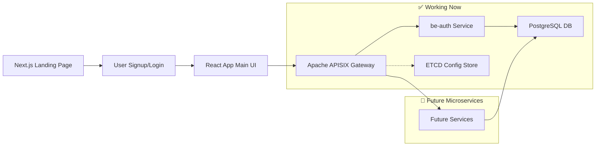

# 💰 Shonchoy

> **Shonchoy** (Bengali: সঞ্চয় meaning "savings") - A modern, scalable personal finance tracking platform built with cutting-edge web technologies. Features complete JWT authentication, PostgreSQL database, and Apache APISIX API gateway integration.

<div align="center">


**Status:** 🚧 In Development | **Version:** MVP Phase | **Auth Service:** ✅ Working

</div>

---

## 📑 Table of Contents

- [Architecture Overview](#architecture-overview)
- [Technology Stack](#technology-stack)
- [Features](#features)
- [Project Structure](#project-structure)
- [Getting Started](#getting-started)
- [Development Workflow](#development-workflow)
- [API Documentation](#api-documentation)
- [Database Schema](#database-schema)
- [Roadmap](#roadmap)

---

## 🏗 Architecture Overview

Shonchoy is built as a modern monorepo utilizing a client-server architecture with REST APIs, designed for scalability and maintainable code organization.

### High-Level Architecture



### Design Principles

- **Monorepo Structure**: Centralized codebase with pnpm workspaces and Turbo build orchestration
- **API Gateway Pattern**: Centralized request routing with authentication, logging, and rate limiting
- **Microservices Ready**: Architecture designed for future migration to microservices with NestJS
- **Mobile-First**: PWA-enabled responsive design for cross-platform compatibility

---

## 🛠 Technology Stack

### Frontend

- **React 19** with TypeScript and Vite for lightning-fast development
- **Next.js 15** with App Router for the landing page and SEO optimization
- **shadcn/ui** + **Tailwind CSS v4** for modern, accessible UI components
- **Chart.js** for interactive financial visualizations
- **React Query** for efficient server state management

### Backend

- **Express.js** with TypeScript and modular architecture
- **PostgreSQL** with connection pooling for robust data persistence
- **JWT Authentication** with bcryptjs password hashing and refresh tokens
- **Apache APISIX** API gateway with load balancing and health checks
- **ETCD** for configuration storage and service discovery

### DevOps & Tooling

- **Docker & Docker Compose** for containerized development environment
- **pnpm** for efficient package management with workspace support
- **Turbo** for intelligent build caching and parallelization
- **ESLint & Prettier** for code quality consistency
- **Jest & Supertest** for unit and integration testing
- **GitHub Actions** for CI/CD pipeline automation

---

## ✨ Features

### Core Functionality

- **📊 Income & Expense Tracking**: Manual entry with customizable categories and CSV import
- **💰 Envelope Budgeting**: Assign budgets per category with visual overspend alerts
- **📈 Portfolio Management**: Investment allocation tools with compound interest projections
- **🏦 Debt Management**: Advanced loan/credit card calculators with payoff simulations
- **📱 Joint Accounts**: Multi-user access with permission levels and merged views

### Advanced Features

- **🔮 What-If Simulations**: Interactive scenario planning for financial decisions
- **📊 Smart Visualizations**: Real-time charts and dashboards with trend analysis
- **⚡ Habit Insights**: Identify spending patterns and savings opportunities
- **🎯 Goal Tracking**: Monitor progress toward financial targets with milestone alerts
- **📄 Export Tools**: Generate reports in PDF/CSV formats

---

## 📁 Project Structure

```
shonchoy/
├── apps/
│   ├── be-auth/                # ✅ Express.js auth microservice
│   ├── react-app/              # Main Vite+React SPA
│   ├── web/                    # Next.js landing page
│   └── gateway/                # Future API gateway service
├── packages/
│   ├── auth-types/             # ✅ Shared auth interfaces & DTOs
│   ├── common-dtos/            # ✅ Shared response types
│   ├── database-entities/      # ✅ Shared database schemas
│   ├── ui/                     # Shared shadcn/ui components
│   ├── eslint-config/          # Shared linting rules
│   └── typescript-config/      # Shared TS configurations
├── services/
│   ├── apisix/                 # ✅ Apache APISIX API gateway
│   └── postgres/               # PostgreSQL service configs
├── docs/                       # Project documentation
│   ├── deployment.md           # APISIX deployment guide
│   ├── pitchdeck.md
│   ├── project_requirement_document.md
│   ├── repository_architecture.md
│   ├── roadmap.md
│   ├── strategic_review.md
│   ├── task_breakdown.md
│   └── upstream-configuration-guide.md
├── scripts/                    # Build and utility scripts
├── .github/                    # GitHub Actions workflows
├── turbo.json                  # Turbo build configuration
├── pnpm-workspace.yaml         # pnpm workspace definition
└── package.json                # Root package configuration
```

### Key Directories

- **`apps/be-auth/`**: ✅ **Working** Express.js authentication microservice with JWT, PostgreSQL, and user management
- **`apps/react-app/`**: Primary user interface built with React 19 and Vite
- **`apps/web/`**: Marketing and landing pages using Next.js for SEO optimization
- **`services/apisix/`**: ✅ **Working** Apache APISIX API gateway with load balancing and health checks
- **`packages/auth-types/`**: ✅ **Working** Shared TypeScript interfaces for authentication
- **`packages/ui/`**: Shared component library based on shadcn/ui and Radix primitives

---

## 🚀 Getting Started

### Prerequisites

- **Node.js** (v20 or higher)
- **pnpm** (v9 or higher)
- **Docker & Docker Compose** (for full development environment)

### Quick Start with Docker (Recommended)

1. **Clone the repository**

   ```bash
   git clone https://github.com/yourusername/shonchoy.git
   cd shonchoy
   ```

2. **Start the complete development environment**

   ```bash
   # Start PostgreSQL, APISIX, ETCD, and all services
   docker-compose up -d

   # Verify services are running
   docker-compose ps
   ```

3. **Install dependencies**

   ```bash
   pnpm install
   ```

4. **Set up environment variables**

   ```bash
   cp .env.example .env
   # The .env file is pre-configured for Docker development
   ```

5. **Configure APISIX (WSL2/Linux/Mac)**

   ```bash
   # Auto-configure APISIX for your environment
   ./scripts/setup-wsl2-apisix.sh
   ```

6. **Start the auth service**

   ```bash
   cd apps/be-auth
   pnpm dev
   ```

### Manual Setup (Alternative)

If you prefer not to use Docker:

1. **Install PostgreSQL 16+ locally**
2. **Create database:**

   ```sql
   CREATE DATABASE shonchoy_auth;
   CREATE USER shonchoy WITH PASSWORD 'your_password';
   GRANT ALL PRIVILEGES ON DATABASE shonchoy_auth TO shonchoy;
   ```

3. **Configure environment variables manually**
4. **Start services individually:**

   ```bash
   pnpm dev:auth    # be-auth service on :4001
   pnpm dev:react   # React app on :3001
   pnpm dev:web     # Next.js on :3000
   ```

### Quick Commands

```bash
# Build all packages and apps
pnpm build

# Run linting across the monorepo
pnpm lint

# Run type checking
pnpm type-check

# Run tests
pnpm test
```

---

## 🔄 Development Workflow

### Adding New Features

1. **Create feature branch**

   ```bash
   git checkout -b feature/new-awesome-feature
   ```

2. **Add UI components** (if needed)

   ```bash
   # Add shadcn/ui components to the web app
   pnpm dlx shadcn@latest add button -c apps/web

   # Components are automatically available in packages/ui/
   ```

3. **Use shared components**

   ```tsx
   import { Button } from "@workspace/ui/components/button";
   import { Input } from "@workspace/ui/components/input";
   ```

4. **API development**
   ```bash
   # API endpoints follow RESTful conventions
   # /api/auth/* - Authentication
   # /api/incomes/* - Income management
   # /api/expenses/* - Expense tracking
   # /api/debt/* - Loan/credit calculations
   ```

### Testing Strategy

- **Unit Tests**: Jest for business logic and calculations
- **Integration Tests**: Supertest for API endpoints
- **E2E Tests**: Cypress for critical user flows
- **Visual Testing**: Storybook for UI component documentation

---

## 🔌 API Documentation

### ✅ Working Endpoints (be-auth Service)

All endpoints are accessible through APISIX gateway at `http://localhost:9080`

#### Authentication Endpoints

```typescript
POST /auth/register        # ✅ User registration with password validation
POST /auth/login           # ✅ User login (returns access + refresh tokens)
POST /auth/refresh         # ✅ Refresh access token using refresh token
POST /auth/logout          # ✅ Revoke refresh token (logout)
```

#### User Management Endpoints

```typescript
GET    /users/profile      # ✅ Get authenticated user profile
PUT    /users/profile      # ✅ Update user profile (firstName, lastName)
GET    /users              # ✅ List users (admin endpoint with pagination)
GET    /users?page=1&limit=10  # ✅ Paginated user listing
```

#### Health Check

```typescript
GET    /health             # ✅ Service health check with uptime
```

### 🚧 Planned Endpoints (Future Services)

```typescript
# Income Management (Future)
GET    /incomes            # List user incomes
POST   /incomes            # Create new income stream

# Expense Tracking (Future)
GET    /expenses           # List expenses with filtering
POST   /expenses           # Record new expense

# Debt Management (Future)
POST   /debt/calculate     # Calculate EMI and schedules
POST   /debt/simulate      # Run payoff simulations

# Portfolio & Projections (Future)
POST   /portfolios/simulate # Investment projections
GET    /portfolios/alerts  # Portfolio rebalancing alerts
```

### Authentication Flow

```bash
# 1. Register user
curl -X POST http://localhost:9080/auth/register \
  -H "Content-Type: application/json" \
  -d '{"email":"user@example.com","password":"password123","firstName":"John","lastName":"Doe"}'

# 2. Login to get tokens
curl -X POST http://localhost:9080/auth/login \
  -H "Content-Type: application/json" \
  -d '{"email":"user@example.com","password":"password123"}'

# 3. Use access token for protected endpoints
curl -H "Authorization: Bearer <ACCESS_TOKEN>" \
  http://localhost:9080/users/profile
```

---

## 🗄 Database Schema

### Core Tables

| Table            | Purpose                        | Key Fields                                   |
| ---------------- | ------------------------------ | -------------------------------------------- |
| `users`          | User authentication & profiles | `id`, `email`, `profile` (JSON)              |
| `incomes`        | Income stream tracking         | `user_id`, `amount`, `type`, `frequency`     |
| `expenses`       | Expense records                | `user_id`, `category`, `amount`, `date`      |
| `assets`         | Asset portfolio                | `user_id`, `type`, `value`, `notes`          |
| `liabilities`    | Debts and loans                | `user_id`, `type`, `amount`, `interest_rate` |
| `budgets`        | Budget allocations             | `user_id`, `period`, `surplus`               |
| `joint_accounts` | Shared access                  | `user_ids`, `permissions` (JSON)             |

### Relationships

- Users have one-to-many relationships with all financial entities
- Joint accounts enable many-to-many user relationships
- Foreign key constraints ensure data integrity

---

## 🛣 Roadmap

### ✅ Phase 1: Foundation (Completed)

- ✅ Monorepo setup with pnpm/Turbo workspaces
- ✅ Docker Compose development environment
- ✅ PostgreSQL database with connection pooling
- ✅ Apache APISIX API gateway with load balancing
- ✅ JWT authentication with refresh tokens
- ✅ User registration and login system
- ✅ Protected API endpoints with middleware
- ✅ Shared TypeScript packages (auth-types, common-dtos)
- ✅ WSL2-compatible APISIX configuration

### 🚧 Phase 2: Core Features (In Progress)

- 🚧 React dashboard with shadcn/ui components
- 🚧 Income and expense tracking
- 🚧 Budget calculations and surplus analysis
- 🚧 Loan/credit card calculators
- 🚧 Basic portfolio management
- 🚧 Data visualization with Chart.js

### 📋 Phase 3: Enhanced Features (Planned)

- 📋 Joint account functionality
- 📋 Advanced financial simulations
- 📋 CSV import/export features
- 📋 PWA offline support
- 📋 Email notifications and alerts
- 📋 Advanced reporting and analytics

### 🔮 Phase 4: Scale & Intelligence (Future)

- 📋 Microservices migration (NestJS)
- 📋 AI-powered financial recommendations
- 📋 Mobile app (React Native)
- 📋 Multi-language support
- 📋 Advanced security features
- 📋 Bank integrations (where available)

### 🎯 Current Status

**Working Components:**

- ✅ **be-auth service**: Complete authentication microservice
- ✅ **APISIX Gateway**: Load balancing and routing
- ✅ **PostgreSQL**: Database with user and session management
- ✅ **Shared Packages**: Type-safe interfaces across services

**Next Priority:**

- 🔄 Complete React dashboard implementation
- 🔄 Add income/expense tracking endpoints
- 🔄 Implement budget calculation logic

---

<div align="center">

**Built with ❤️ for better financial wellness**

_Shonchoy empowers individuals and families to take control of their financial future through intelligent tracking, insightful projections, and user-friendly tools._

</div>
