# Product Requirements Document (PRD) for Shonchoy

## 1. Product Overview

### 1.1 Product Name

Shonchoy (Personal Finance Tracker)

### 1.2 Product Description

Shonchoy is a web-based personal finance tracking application designed for users seeking to manage their finances effectively. It allows users to monitor income streams, expenses, assets, liabilities, budgeting, and investment portfolios in a secure and intuitive way. The app supports manual entry for tracking financial data, with features like envelope budgeting, habit insights, and goal projections. It promotes financial discipline by visualizing spending patterns, calculating surpluses, and providing tools for diversified portfolio management, including projections that account for inflation and growth.

The app is adaptable for individual or joint use (e.g., couples or families) and focuses on scalability for various life stages, such as career changes, major purchases, or long-term planning.

### 1.3 Target Audience

- Primary: Individuals and households interested in personal finance management, including professionals, families, and retirees.
- Secondary: Users in emerging markets (e.g., Bangladesh or similar economies) dealing with inflation, variable incomes, or limited banking integrations; also suitable for global users with manual tracking needs.
- User Persona: A general user, such as a mid-career professional with steady income, everyday expenses, assets like savings or investments, and goals for short-term purchases (e.g., home improvements) and long-term security (e.g., retirement).

### 1.4 Business Goals

- Help users achieve better savings rates by identifying spending leaks and providing actionable insights.
- Offer tools for portfolio diversification and growth projections to support informed decision-making.
- Foster positive financial habits through tracking, alerts, and simulations.
- Monetization: Free basic version; premium for advanced features like detailed projections, AI-driven recommendations, or premium simulations (e.g., annual subscription at market-competitive pricing).
- Metrics for Success: High user retention (e.g., 80% after 3 months); frequent engagement (e.g., 4+ logins/week); measurable improvements in user-reported financial habits (e.g., 15-20% average reduction in tracked discretionary spends); premium conversion rate of 10-15%.

### 1.5 Key Assumptions and Constraints

- No automatic bank integrations (manual entry primary).
- Currency: Multi-currency support, with defaults like BDT, USD, EUR.
- Data Privacy: Compliant with relevant regulations (e.g., GDPR or local data laws); user data not sold or shared without explicit consent.
- Offline Support: Basic caching for recent data via PWA.
- Scope: MVP emphasizes core tracking; expansions for advanced tools.
- Additional Constraints: Browser compatibility (latest Chrome, Firefox, Safari; no IE support); maximum data storage per user (e.g., 10MB for free tier to control costs); no real-time currency conversion in MVP (user-input rates only).

## 2. Features and Requirements

### 2.1 Core Features

- **User Authentication and Profiles:**
  - Secure signup/login (email/password, OAuth options like Google, Apple).
  - Support for multiple profiles: Invite family members for joint accounts with merged views and permission levels (e.g., view-only for shared reports).
  - Profile setup: Basic details like income sources, goals, and preferences (e.g., inflation rate assumptions, custom categories).

- **Income Tracking:**
  - Add/edit income streams (e.g., salary, freelance, investments).
  - Projections: Calculate potential growth based on user-input rates (e.g., annual hikes).
  - Support for variable incomes (e.g., side gigs) with averaging tools.

- **Expense Tracking:**
  - Manual entry with customizable categories (e.g., subscriptions, utilities, discretionary spends).
  - Envelope Budgeting: Assign and track budgets per category with visual overspend alerts.
  - Habit Insights: Identify recurring habits, simulate savings from reductions (e.g., "Reduce subscriptions by 20%: Save $X/month, add $Y to retirement in 5 years"), and provide motivational visualizations.
  - Recurring expenses: Auto-reminders for bills or payments, with import from CSV for bulk entry.

- **Budgeting and Surplus Calculation:**
  - Flexible systems like zero-based or envelope budgeting.
  - Dashboard for monthly/annual surpluses and projections, factoring in life events (e.g., income changes, one-time expenses).
  - What-If Simulations: Interactive tool for scenario planning (e.g., "What if I reduce X expense by Y%? Impact on surplus, net worth, and goals over Z years").

- **Assets and Liabilities:**
  - Track various assets (e.g., cash, investments, property) and liabilities (e.g., loans, credit cards).
  - Net Worth Calculator: Automatic aggregation, trends, and historical comparisons.
  - Modules for insurance or other protections, with reminder alerts for renewals.

- **Portfolio Management:**
  - Allocation tools: Suggest or track diversified mixes (e.g., low-risk savings, medium-term bonds, growth investments) with pie chart visualizations.
  - Features like auto-reinvest alerts, maturity laddering, and rebalance reminders.
  - Projections: Compound interest simulators for goals like retirement, adjusting for inflation, with sensitivity analysis (e.g., varying return rates).

- **Loan/Credit Card Payment Calculator and Simulation Module:**
  - Loan Calculator: Compute EMI (Equated Monthly Installment), total interest, amortization schedules for fixed/variable rate loans (e.g., home, auto, personal loans).
  - Credit Card Simulator: Calculate minimum payments, interest accrual, payoff timelines for revolving credit; simulate balance transfers or extra payments.
  - What-If Simulations: Interactive scenarios (e.g., "What if I pay extra $X/month? Reduce payoff time by Y months, save $Z in interest"); integrate with surplus/budget for personalized advice.
  - Visualizations: Amortization charts, payoff curves; export schedules as PDF/CSV.
  - Integration: Link to liabilities tracking; auto-update net worth based on simulations.

- **Reporting and Visualizations:**
  - Dashboards: Charts for expenses, assets, and growth trends (e.g., line graphs for surplus over time).
  - Goal Tracker: Monitor progress toward user-defined targets (e.g., vacations, major purchases) with progress bars and milestone notifications.
  - Export: Reports in PDF/CSV formats, including customizable templates.

- **Additional Tools:**
  - Risk Alerts: Notifications for gaps (e.g., low emergency funds, high debt ratios).
  - Gamification: Rewards for consistent use or milestone achievements (e.g., badges for 30-day tracking streaks, unlocking premium previews).

### 2.2 Non-Functional Requirements

- Performance: Quick loads (<2s); scalable for growing users (target 10K active users in year 1).
- Security: Encrypted data (HTTPS, AES for sensitive fields), secure auth (rate limiting, 2FA option).
- Accessibility: Responsive design, multi-language support (English default; Bengali/others in V1.1), WCAG 2.1 Level AA compliance.
- Scalability: Cloud-compatible (e.g., AWS or Vercel); handle peak loads during month-ends.
- Reliability: 99.9% uptime; automated backups.

### 2.3 User Stories

- As a user, I want to track expenses manually to monitor daily habits.
- As a family, I want joint access to combine financial views.
- As an investor, I want goal projections to plan for the future.
- As a budgeter, I want alerts to stay within category limits.
- As a habit-builder, I want simulations to see benefits of reducing specific expenses, so I can stay motivated.
- As a borrower, I want to calculate loan EMIs and simulate early payoffs to optimize debt management.
- As a credit card user, I want to simulate payment strategies to minimize interest and accelerate debt freedom.

### 2.4 Prioritization (MVP vs. Future)

- MVP: Auth, Core Tracking (Income/Expenses/Budget), Dashboard, Basic Portfolio, Basic Simulations, Basic Loan/Credit Calculator.
- V1.1: Joint Features, Advanced Projections, Habit Insights, Gamification, Advanced Loan/Credit Simulations.
- Future: Integrations (if available), AI suggestions, Mobile Apps.

## 3. Design and UX Guidelines

- UI: Modern, intuitive (e.g., shadcn/ui with Tailwind CSS v4); theme options (light/dark mode).
- Flow: Easy onboarding wizard; customizable forms with auto-suggestions.
- Mobile-First: Fully responsive; PWA for installable experience.

### 3.1 Visual Aids

#### Feature Prioritization Table

| Feature Category          | MVP        | V1.1               | Future                 |
| ------------------------- | ---------- | ------------------ | ---------------------- |
| Authentication & Profiles | Yes        | Joint Enhancements | Multi-Tenancy          |
| Income/Expense Tracking   | Yes        | Simulations        | AI Categorization      |
| Budgeting & Surplus       | Yes        | What-If Tools      | Predictive Analytics   |
| Assets/Liabilities        | Basic      | Trends             | Insurance Integrations |
| Portfolio Management      | Basic      | Projections        | Auto-Rebalancing       |
| Loan/Credit Module        | Basic Calc | Simulations        | AI Debt Advice         |
| Reporting/Visualizations  | Dashboards | Exports            | Custom Reports         |
| Additional Tools          | Alerts     | Gamification       | AI Recommendations     |

#### High-Level User Flow (Mermaid Diagram)

## 4. Risks and Dependencies

- Risks: User drop-off from manual entry – Address with simple UI and gamification; data privacy breaches – Mitigate with audits; scalability issues – Plan for microservices migration; inaccurate calculations – Validate formulas with unit tests.
- Dependencies: Tech stack as specified; third-party libs (e.g., Chart.js must be <5MB bundle size); math libraries for calculations (e.g., client-side JS for simulations).
- Timeline: MVP in 8-12 weeks (design 2w, dev 6w, test/QA 2w).

## 5. Success Criteria

- User Feedback: NPS >8/10; high satisfaction scores via in-app surveys.
- Adoption: Steady user growth via organic means (target 1K users in 6 months); viral coefficient >1 from joint invites.
- Business: Premium uptake (10% of users); positive ROI on development within 18 months.

---

# Technical Specification for Shonchoy Web App

## 1. Architecture Overview

- **High-Level Design:** ✅ **Implemented** - Monorepo with client-server architecture using REST APIs. be-auth microservice in Express.js with TypeScript, Apache APISIX API gateway for routing, PostgreSQL database. Shared TypeScript packages for type safety across services.
- **Deployment:** ✅ **Implemented** - Docker Compose for local development with PostgreSQL, APISIX, and ETCD. Monorepo with pnpm workspaces and Turbo build orchestration.
- **Data Flow:** ✅ **Implemented** - UI → APISIX Gateway (load balancing, health checks) → be-auth Service (JWT auth, business logic) → PostgreSQL DB.
- **Scalability:** ✅ **Ready** - Containerized architecture ready for Kubernetes orchestration. Modular service design enables easy addition of new microservices.
- **Security:** ✅ **Implemented** - JWT authentication with refresh tokens, bcryptjs password hashing, input validation, CORS protection, and Helmet security headers.

### 1.1 Architecture Diagram (Mermaid)

```mermaid
graph LR
    A[Next.js Landing Page] --> B[User Signup/Login]
    B --> C[React App Main UI]
    C --> D[Apache APISIX Gateway]
    D --> E[be-auth Service ✅]
    D --> F[Future Services]
    E --> G[PostgreSQL DB ✅]
    F --> G

    subgraph "✅ Working Now"
        D
        E
        G
    end

    subgraph "🚧 Future Microservices"
        F
    end
```

## 2. Technology Stack

- **Frontend:** React 19 (TypeScript) with Vite for main app (react-app), Next.js for landing page (web), shadcn/ui with Tailwind CSS v4, Chart.js, React Query.
- **Backend:** ✅ **Implemented** - Express.js (TypeScript) with modular architecture, Apache APISIX API gateway, JWT authentication with jose library, bcryptjs password hashing.
- **Database:** ✅ **Implemented** - PostgreSQL 16 with connection pooling, custom SQL scripts for schema management.
- **Services:** ✅ **Implemented** - Apache APISIX with ETCD configuration store, load balancing, and health checks.
- **Other:** Testing (Jest/Supertest), CI/CD (GitHub Actions), pnpm workspaces, Turbo build orchestration; Docker Compose for development environment.

## 3. Database Schema

### 3.1 Schema Overview Table

| Table         | Key Fields                                                                                                                           | Relationships   | Notes                                                         |
| ------------- | ------------------------------------------------------------------------------------------------------------------------------------ | --------------- | ------------------------------------------------------------- |
| Users         | id (PK), email (unique), profile (JSON)                                                                                              | 1:M with others | Stores preferences like inflation rate.                       |
| Incomes       | id (PK), user_id (FK), amount (decimal), type (enum), frequency (enum), notes (text)                                                 | M:1 User        | Supports projections via stored rates.                        |
| Expenses      | id (PK), user_id (FK), category (string), amount (decimal), date (date), recurring (bool)                                            | M:1 User        | Indexes on date for queries.                                  |
| Assets        | id (PK), user_id (FK), type (enum), value (decimal), notes (text)                                                                    | M:1 User        | JSON for custom details.                                      |
| Liabilities   | id (PK), user_id (FK), type (enum: loan, credit_card), amount (decimal), end_date (date), interest_rate (decimal), term_months (int) | M:1 User        | Extended for loan/credit details; triggers for payoff alerts. |
| Portfolios    | id (PK), user_id (FK), allocation (JSON), projections (JSON)                                                                         | M:1 User        | Stores simulation results.                                    |
| Budgets       | id (PK), user_id (FK), period (date), surplus (decimal)                                                                              | M:1 User        | Aggregates from incomes/expenses.                             |
| JointAccounts | id (PK), user_ids (array), merged (bool)                                                                                             | M:M Users       | Permissions stored in JSON.                                   |

- Relationships and indexes as needed (e.g., foreign keys, unique constraints).

## 4. API Endpoints

### ✅ Implemented Endpoints (be-auth Service)

All endpoints accessible through APISIX gateway at `http://localhost:9080`

- **Auth:** POST `/auth/register`, POST `/auth/login` (returns JWT), POST `/auth/refresh`, POST `/auth/logout`.
- **Users:** GET `/users/profile` (protected), PUT `/users/profile` (protected), GET `/users` (admin with pagination).
- **Health:** GET `/health` (service health check).

### 🚧 Planned Endpoints (Future Services)

- **Incomes/Expenses/Assets/Liabilities:** CRUD via `/api/{resource}` (e.g., POST `/api/incomes`, GET `/api/expenses?userId=xx`).
- **Budgets:** GET `/api/budgets/surplus` (calc), POST `/api/budgets/envelope`.
- **Portfolios:** POST `/api/portfolios/simulate` (projections), GET `/api/portfolios/alerts`.
- **Debt (Loan/Credit):** POST `/api/debt/calculate` (EMI/interest for loans), POST `/api/debt/simulate` (what-if payoffs), GET `/api/debt/schedule` (amortization).
- **Reports:** GET `/api/reports/dashboard` (JSON for charts), GET `/api/reports/export?format=csv` (export reports).
- **Joint:** POST `/api/joint/invite`, GET `/api/joint/merged`.
- All future routes will be prefixed through APISIX gateway for modularity.

## 5. Frontend Structure

- Components: Layout (Nav/Sidebar), Dashboard (Charts/Simulations), Forms (Entry/Custom), Pages (Income, Portfolio, DebtCalculator, etc.).
- State: Context/Reducer for global (e.g., user), React Query for API caching/mutations.
- Routing: React Router for app; Next.js pages for landing (e.g., /pricing, /blog).
- Visuals: Responsive charts; integrate Mermaid.js client-side for user-generated diagrams if needed; sliders/inputs for simulation parameters.

## 6. Calculations and Logic

- **Surplus:** Sum(incomes) - Sum(expenses) (server-side for accuracy, with caching).
- **Projections:** `Future Value = PV _ (1 + r)^n + PMT _ (((1 + r)^n - 1) / r)`; implement in a dedicated service (e.g., be-auth service).
- **Simulations:** What-if logic: Clone current data, apply changes (e.g., expense -= Y%), recompute surplus/projections.
- **Loan EMI:** `EMI = P _ (r _ (1 + r)^n) / ((1 + r)^n - 1)`; where P=principal, r=monthly rate, n=term months.
- **Credit Card Payoff:** Balance iteration: New balance = old + interest - payment; simulate until zero.
- **Alerts:** Cron jobs (node-cron) for scheduled checks/emails.

## 7. Testing and Quality

- Unit: Services/components (80% coverage with Jest); special focus on calc accuracy (e.g., EMI edge cases).
- Integration: API (Supertest).
- E2E: User flows (Cypress).
- Security: Regular scans (e.g., npm audit).

## 8. Deployment and Maintenance

- Env: .env files for secrets (e.g., DB_URL, JWT_SECRET).
- Monitoring: Sentry, Prometheus; logs via Winston.
- CI/CD: Build/test/deploy via GitHub Actions.

## 9. Future Expansions and Considerations

- **Microservices Architecture:** Transition to microservices with NestJS, separating modules into individual backend services (e.g., auth, finance tracking, reporting, debt) for better scalability and maintainability. Use API gateway for routing; consider Kafka for inter-service communication.
- **AI and Machine Learning:** Integrate AI-driven recommendations for budgeting, investment suggestions, and personalized financial insights (e.g., via OpenAI API for natural language queries).
- **Bank Integrations:** Add support for automatic bank data imports and syncing (e.g., via Plaid-like services if available in target markets).
- **Mobile App:** Develop native mobile applications for iOS and Android using React Native.
- **Advanced Analytics:** Implement more sophisticated data analytics and predictive modeling (e.g., trend forecasting with ML).
- **Multi-tenancy:** Support for enterprise features and team management (e.g., business accounts).
- **Internationalization:** Expand to support more languages and regions, with locale-specific defaults.
- **Performance Optimizations:** Implement caching (Redis), CDN for static assets, and advanced optimization techniques (e.g., code splitting).
- **Enhancements to Gateway:** Extrapolate current gateway to include load balancing, service discovery (e.g., Consul), and API versioning for smooth microservices migration.
