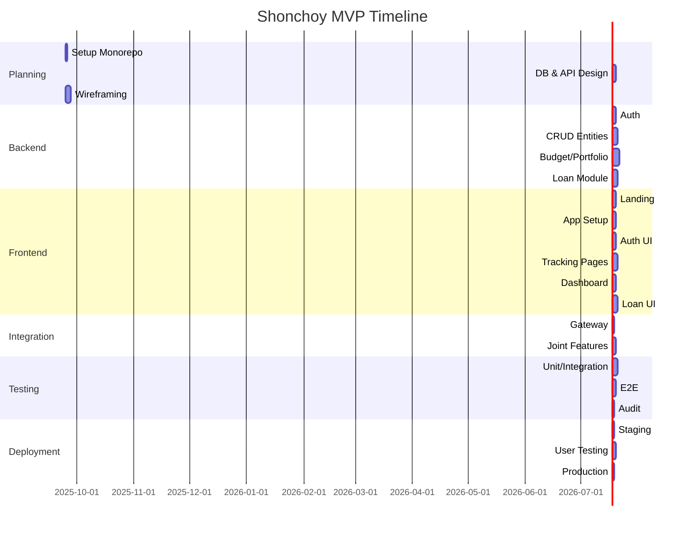

# Task Breakdown for Shonchoy Development

This task breakdown is structured logically and sequentially, following a standard software development lifecycle (SDLC) approach: **Planning & Setup**, **Backend Development**, **Frontend Development**, **Integration & Features**, **Testing & QA**, **Deployment & Launch**, and **Post-MVP Iterations**. Each phase includes detailed sub-tasks that can be directly converted into assignable tickets (e.g., in Jira, Trello, or GitHub Issues). Tickets should include:

- **Assignee**: e.g., Backend Dev, Frontend Dev, Designer, QA.
- **Priority**: High/Medium/Low.
- **Dependencies**: Preceding tasks.
- **Estimation**: Rough story points or time (e.g., 1-2 days).
- **Acceptance Criteria**: Measurable outcomes.

The breakdown prioritizes MVP features first, with references to the PRD and Tech Spec. Total estimated timeline: 8-12 weeks for MVP, assuming a small team (2-3 devs, 1 designer/QA).

## 1. Planning & Setup (Week 1)

Focus: Establish foundations, tools, and initial designs.

- **Task 1.1: Set Up Monorepo Structure**
  - Description: Initialize monorepo with pnpm and Turbo; create folders for react-app (main UI), web (Next.js landing), backend (Express), and shared configs.
  - Dependencies: None.
  - Assignee: Lead Dev.
  - Priority: High.
  - Estimation: 1 day.
  - Acceptance Criteria: Monorepo builds successfully; basic scripts for build/test/deploy work.

- **Task 1.2: Database Setup**
  - Description: Set up PostgreSQL locally (e.g., via Docker); define initial schema migrations using pg or TypeORM based on Section 3 of Tech Spec.
  - Dependencies: None.
  - Assignee: Backend Dev.
  - Priority: High.
  - Estimation: 1-2 days.
  - Acceptance Criteria: DB container runs; schema tables (Users, Incomes, etc.) created and testable via queries.

- **Task 1.3: UI/UX Wireframing**
  - Description: Create wireframes for key screens (Dashboard, Tracking Pages, Loan Calculator) using Figma or Sketch; incorporate mobile-first design from PRD Section 3.
  - Dependencies: None.
  - Assignee: Designer.
  - Priority: High.
  - Estimation: 2-3 days.
  - Acceptance Criteria: Wireframes approved; include user flows (e.g., Mermaid diagram from PRD).

- **Task 1.4: API Design & Documentation**
  - Description: Define REST endpoints (e.g., /auth, /api/incomes) with Swagger or Postman; include gateway pattern logic.
  - Dependencies: Task 1.2.
  - Assignee: Backend Dev.
  - Priority: Medium.
  - Estimation: 1 day.
  - Acceptance Criteria: API docs generated; endpoints match Tech Spec Section 4.

- **Task 1.5: CI/CD Pipeline Setup**
  - Description: Configure GitHub Actions for build/test/deploy; include linting (ESLint/Prettier) and basic tests.
  - Dependencies: Task 1.1.
  - Assignee: DevOps/Lead Dev.
  - Priority: Medium.
  - Estimation: 1 day.
  - Acceptance Criteria: Pipeline runs on PRs; deploys to staging (e.g., Vercel/Render).

## 2. Backend Development (Weeks 2-4)

Focus: Build core services, starting with auth and data handling.

- **Task 2.1: Implement Authentication**
  - Description: Set up JWT auth in Express; handle register/login/profile endpoints; integrate OAuth (Google/Apple).
  - Dependencies: Task 1.2, 1.4.
  - Assignee: Backend Dev.
  - Priority: High.
  - Estimation: 2 days.
  - Acceptance Criteria: Endpoints testable; tokens validate; 2FA stubbed for future.

- **Task 2.2: CRUD for Core Entities**
  - Description: Implement CRUD for Incomes, Expenses, Assets, Liabilities (extend for loan/credit details like interest_rate).
  - Dependencies: Task 2.1.
  - Assignee: Backend Dev.
  - Priority: High.
  - Estimation: 3 days.
  - Acceptance Criteria: APIs return correct data; validation for inputs (e.g., decimal amounts).

- **Task 2.3: Budgeting & Surplus Logic**
  - Description: Build surplus calculation service; envelope assignment; integrate with cron for alerts.
  - Dependencies: Task 2.2.
  - Assignee: Backend Dev.
  - Priority: Medium.
  - Estimation: 2 days.
  - Acceptance Criteria: GET /budgets/surplus computes accurately; alerts trigger via mock emails.

- **Task 2.4: Portfolio & Projections**
  - Description: Implement allocation JSON handling; compound interest formulas from Tech Spec Section 6.
  - Dependencies: Task 2.2.
  - Assignee: Backend Dev.
  - Priority: Medium.
  - Estimation: 2 days.
  - Acceptance Criteria: POST /portfolios/simulate returns FV projections; handles inflation.

- **Task 2.5: Loan/Credit Module**
  - Description: Add debt service with EMI calc, amortization schedules, payoff simulations; use mathjs for formulas.
  - Dependencies: Task 2.2.
  - Assignee: Backend Dev.
  - Priority: High.
  - Estimation: 3 days.
  - Acceptance Criteria: POST /debt/calculate outputs EMI/total interest; simulations adjust for extra payments.

- **Task 2.6: Reporting & Exports**
  - Description: Generate JSON for dashboards; CSV/PDF exports using libraries like pdfmake.
  - Dependencies: Task 2.3-2.5.
  - Assignee: Backend Dev.
  - Priority: Medium.
  - Estimation: 2 days.
  - Acceptance Criteria: GET /reports/export produces files; data aggregates correctly.

- **Task 2.7: Joint Accounts & Permissions**
  - Description: Implement invite/merge logic; handle merged views with permissions.
  - Dependencies: Task 2.1.
  - Assignee: Backend Dev.
  - Priority: Medium (V1.1).
  - Estimation: 2 days.
  - Acceptance Criteria: Merged data queries work; view-only mode enforced.

## 3. Frontend Development (Weeks 3-5, parallel to Backend)

Focus: Build UI components, overlapping with backend for API mocks if needed.

- **Task 3.1: Landing Page (Next.js)**
  - Description: Build marketing pages (/home, /pricing, /features) with SEO; integrate signup CTA.
  - Dependencies: Task 1.3.
  - Assignee: Frontend Dev.
  - Priority: High.
  - Estimation: 2 days.
  - Acceptance Criteria: Pages responsive; deploys to Vercel.

- **Task 3.2: Main App Setup (React/Vite)**
  - Description: Set up routing, state (Context/React Query), theme (Tailwind/shadcn); PWA manifest.
  - Dependencies: Task 1.3.
  - Assignee: Frontend Dev.
  - Priority: High.
  - Estimation: 1-2 days.
  - Acceptance Criteria: App skeleton loads; protected routes work.

- **Task 3.3: Authentication UI**
  - Description: Forms for login/signup; OAuth buttons; profile setup wizard.
  - Dependencies: Task 3.2, Backend Task 2.1.
  - Assignee: Frontend Dev.
  - Priority: High.
  - Estimation: 2 days.
  - Acceptance Criteria: Integrates with auth APIs; redirects to dashboard.

- **Task 3.4: Tracking Pages (Income/Expenses)**
  - Description: Forms for manual entry; lists with edits; CSV import.
  - Dependencies: Task 3.2, Backend Task 2.2.
  - Assignee: Frontend Dev.
  - Priority: High.
  - Estimation: 3 days.
  - Acceptance Criteria: Data syncs via React Query; real-time updates.

- **Task 3.5: Dashboard & Visualizations**
  - Description: Charts (Chart.js) for surplus/trends; net worth calc.
  - Dependencies: Task 3.4, Backend Task 2.3.
  - Assignee: Frontend Dev.
  - Priority: Medium.
  - Estimation: 2 days.
  - Acceptance Criteria: Responsive charts; data fetches from APIs.

- **Task 3.6: Portfolio & Simulations UI**
  - Description: Allocation pies; projection sliders; what-if inputs.
  - Dependencies: Task 3.5, Backend Task 2.4.
  - Assignee: Frontend Dev.
  - Priority: Medium.
  - Estimation: 2 days.
  - Acceptance Criteria: Simulations update dynamically; results visualized.

- **Task 3.7: Loan/Credit Calculator UI**
  - Description: Forms for inputs (principal, rate, term); display schedules/charts; integrate simulations.
  - Dependencies: Task 3.5, Backend Task 2.5.
  - Assignee: Frontend Dev.
  - Priority: High.
  - Estimation: 3 days.
  - Acceptance Criteria: Interactive EMI calc; payoff curves; links to liabilities.

- **Task 3.8: Additional Tools (Alerts/Gamification)**
  - Description: Notification UI; badges for streaks.
  - Dependencies: Task 3.5, Backend Task 2.6.
  - Assignee: Frontend Dev.
  - Priority: Medium (V1.1).
  - Estimation: 2 days.
  - Acceptance Criteria: Alerts display; gamification unlocks features.

## 4. Integration & Features (Weeks 5-6)

Focus: Connect FE/BE; add polish.

- **Task 4.1: API Gateway Integration**
  - Description: Route all FE calls through gateway; add logging/rate limiting.
  - Dependencies: Backend Phase 2, Frontend Phase 3.
  - Assignee: Backend Dev.
  - Priority: High.
  - Estimation: 1 day.
  - Acceptance Criteria: All endpoints proxied; no direct service calls.

- **Task 4.2: Joint Features Integration**
  - Description: UI for invites; merged dashboards.
  - Dependencies: Task 2.7, 3.8.
  - Assignee: Full-Stack Dev.
  - Priority: Medium.
  - Estimation: 2 days.
  - Acceptance Criteria: Shared views load; permissions respected.

- **Task 4.3: Offline Support & PWA**
  - Description: Cache data with service workers; basic offline tracking.
  - Dependencies: Task 3.2.
  - Assignee: Frontend Dev.
  - Priority: Low.
  - Estimation: 1 day.
  - Acceptance Criteria: App installable; works offline for views.

## 5. Testing & QA (Weeks 6-7)

Focus: Ensure quality.

- **Task 5.1: Unit & Integration Tests**
  - Description: Cover calcs (e.g., EMI), APIs with Jest/Supertest.
  - Dependencies: Phases 2-4.
  - Assignee: Dev Team.
  - Priority: High.
  - Estimation: 3 days.
  - Acceptance Criteria: 80% coverage; all pass.

- **Task 5.2: E2E Tests**
  - Description: User flows (e.g., signup to simulation) with Cypress.
  - Dependencies: Task 5.1.
  - Assignee: QA.
  - Priority: High.
  - Estimation: 2 days.
  - Acceptance Criteria: Flows automated; bugs fixed.

- **Task 5.3: Security & Accessibility Audit**
  - Description: Scan for vulnerabilities; check WCAG compliance.
  - Dependencies: Task 5.1.
  - Assignee: QA/Dev.
  - Priority: Medium.
  - Estimation: 1 day.
  - Acceptance Criteria: No high-sev issues; reports generated.

## 6. Deployment & Launch (Week 8)

Focus: Go-live.

- **Task 6.1: Staging Deployment**
  - Description: Deploy to staging; seed test data.
  - Dependencies: Phase 5.
  - Assignee: DevOps.
  - Priority: High.
  - Estimation: 1 day.
  - Acceptance Criteria: App accessible; monitoring set (Sentry).

- **Task 6.2: User Testing & Feedback**
  - Description: Beta test with 5-10 users; iterate on bugs.
  - Dependencies: Task 6.1.
  - Assignee: QA/Product.
  - Priority: Medium.
  - Estimation: 2 days.
  - Acceptance Criteria: Feedback incorporated; NPS >8.

- **Task 6.3: Production Deployment**
  - Description: Deploy to prod; set up backups/uptime monitoring.
  - Dependencies: Task 6.2.
  - Assignee: DevOps.
  - Priority: High.
  - Estimation: 1 day.
  - Acceptance Criteria: Live app; domain configured.

## 7. Post-MVP Iterations (Weeks 9+)

Focus: Enhancements from PRD/Tech Spec Section 9.

- **Task 7.1: Microservices Migration**
  - Description: Refactor to NestJS services (e.g., debt service).
  - Dependencies: MVP Launch.
  - Assignee: Backend Dev.
  - Priority: Medium.
  - Estimation: 5-7 days.
  - Acceptance Criteria: Services independent; gateway routes correctly.

- **Task 7.2: AI Recommendations**
  - Description: Integrate OpenAI for insights (e.g., debt advice).
  - Dependencies: Task 7.1.
  - Assignee: Full-Stack Dev.
  - Priority: Low.
  - Estimation: 3 days.
  - Acceptance Criteria: Natural language queries work.

- **Task 7.3: Mobile App Prep**
  - Description: Share code for React Native version.
  - Dependencies: MVP.
  - Assignee: Frontend Dev.
  - Priority: Low.
  - Estimation: 4 days.
  - Acceptance Criteria: Basic mobile prototype.

### Project Gantt Chart (Mermaid Diagram)

